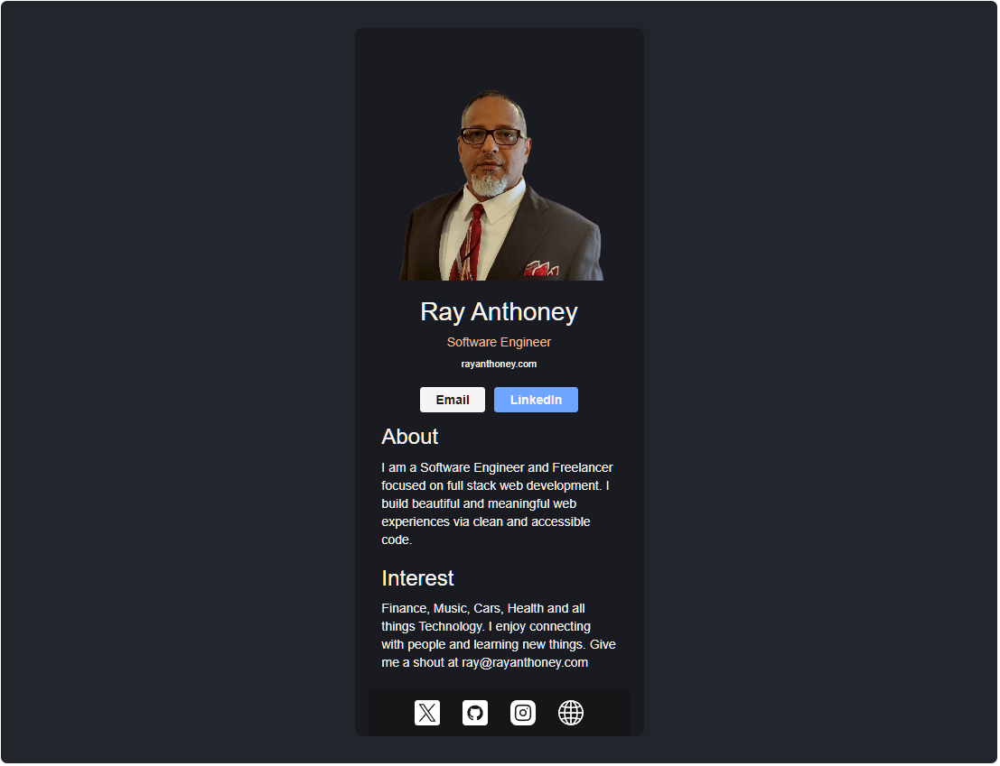

<!-- My Banner Section -->
# Digital Business Card - React

<!-- link to project -->
    <a href='-URL TO DEMO GOES HERE-'>
    <!-- link to local image -->
<!--          -->
    </a>

**Link to project:** http://recruiters-love-seeing-live-demos.com/

        
        
    

 

  

## React + Vite

This template provides a minimal setup to get React working in Vite with HMR and some ESLint rules.

Currently, two official plugins are available:

- [@vitejs/plugin-react](https://github.com/vitejs/vite-plugin-react/blob/main/packages/plugin-react/README.md) uses [Babel](https://babeljs.io/) for Fast Refresh
- [@vitejs/plugin-react-swc](https://github.com/vitejs/vite-plugin-react-swc) uses [SWC](https://swc.rs/) for Fast Refresh

## Flat Icons attributes

- [riajulislam](<a href="https://www.flaticon.com/free-icons/github" title="github icons">Github icons created by riajulislam - Flaticon</a>)
- [riajulislam](<a href="https://www.flaticon.com/free-icons/linkedin" title="linkedin icons">Linkedin icons created by riajulislam - Flaticon</a>)
- [FreePik](<a href="https://www.flaticon.com/free-icons/instagram" title="instagram icons">Instagram icons created by Freepik - Flaticon</a>)
- [FreePik](<a href="https://www.flaticon.com/free-icons/email" title="email icons">Email icons created by Freepik - Flaticon</a>)
